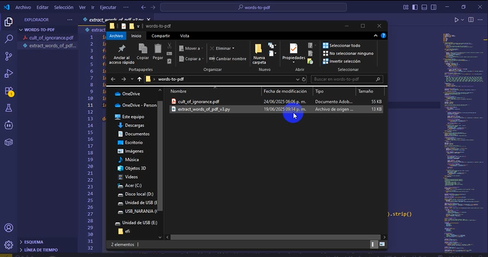
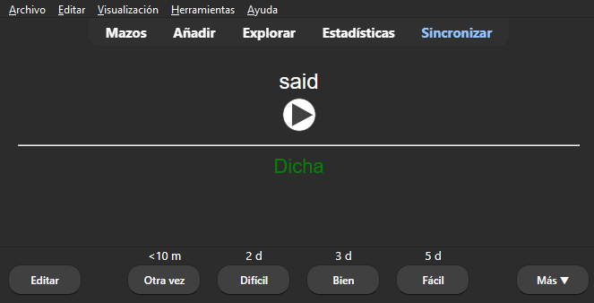

# 📚 Convertidor de PDF a Flashcards para Anki | Aprende Inglés con Lectura + Audio + Traducción


## 🔍 Índice

  - [🏷️ Descripción](#🏷️-Descripción)
    - [¿Qué hace?](#¿Qué-hace)
    - [🧠 Enfoque pedagógico](#🧠-Enfoque-pedagógico)
    - [✨  ¿Por qué funciona?](#✨--¿Por-qué-funciona)
  - [📁 Estructura del proyecto](#📁-Estructura-del-proyecto)
  - [✨ Características principales](#✨-Características-principales)
    - [🛠️ Funcionalidades clave](#🛠️-Funcionalidades-clave)
    - [🎓 Beneficios para el aprendizaje](#🎓-Beneficios-para-el-aprendizaje)
  - [⚙️ Instalación](#⚙️-Instalación)
  - [🚀 ¿Cómo se utiliza?](#🚀-¿Cómo-se-utiliza)
    - [✅ Requisitos previos](#✅-Requisitos-previos)
    - [🧭 Pasos para usar el script](#🧭-Pasos-para-usar-el-script)
  - [⚠️ Solución a errores comunes](#⚠️-Solución-a-errores-comunes)
    - [🔊 Error 1: Problemas al generar audio con gTTS](#🔊-Error-1-Problemas-al-generar-audio-con-gTTS)
    - [🌍 Error 2: Fallos en la traducción automática](#🌍-Error-2-Fallos-en-la-traducción-automática)
  - [📥  Cómo Importar a Anki  (Guía Paso a Paso)](#📥--Cómo-Importar-a-Anki--Guía-Paso-a-Paso)
    - [📦 Archivos generados por el script](#📦-Archivos-generados-por-el-script)
    - [🧰 Requisitos previos](#🧰-Requisitos-previos)
    - [🔧 PASO 1 – Copiar los audios a Anki](#🔧-PASO-1-–-Copiar-los-audios-a-Anki)
    - [🎴 PASO 2 – Crear un modelo de tarjeta personalizado](#🎴-PASO-2-–-Crear-un-modelo-de-tarjeta-personalizado)
    - [📥 PASO 3 – Importar el archivo de tarjetas](#📥-PASO-3-–-Importar-el-archivo-de-tarjetas)
  - [🧠 Problema y Solución](#🧠-Problema-y-Solución)
    - [🔹 1. Desafíos clave y soluciones implementadas](#🔹-1-Desafíos-clave-y-soluciones-implementadas)
    - [🔹 2. Diseño del flujo completo](#🔹-2-Diseño-del-flujo-completo)
    - [🔹 3. Lecciones aprendidas](#🔹-3-Lecciones-aprendidas)
  - [🧠 Explicación de mi proceso de pensamiento](#🧠-Explicación-de-mi-proceso-de-pensamiento)
  - [🚀 Mejoras futuras / Limitaciones](#🚀-Mejoras-futuras--Limitaciones)
    - [🛑 Limitaciones actuales](#🛑-Limitaciones-actuales)
    - [🚀 Mejoras planeadas](#🚀-Mejoras-planeadas)
  - [📬 Contacto](#📬-Contacto)

---

## 🏷️ Descripción

Este proyecto nace de una idea simple pero poderosa: **la lectura es una de las formas más efectivas para aprender inglés, especialmente como adulto**. Inspirado en el método propuesto por [Víctor Políglota](https://www.youtube.com/watch?v=nxnJjlIeQk0), esta herramienta automatiza el proceso de extraer vocabulario relevante de libros reales en PDF, traduce las palabras y genera su pronunciación en audio, para que puedas estudiarlas en Anki sin esfuerzo manual.

### ¿Qué hace?

Transforma tus lecturas en **tarjetas de estudio inteligentes** para Anki con:

- 📖 Palabras extraídas directamente de tus libros en inglés.
- ✍️ Traducción automática al español (o cualquier idioma que desees).
- 🔊 Archivos de audio con la pronunciación en inglés.

Todo esto, sin perder tiempo en anotar, buscar o copiar, y con total compatibilidad con Anki.

---

### 🧠 Enfoque pedagógico

Basado en el método de lectura de Víctor Políglota ([ver video](https://www.youtube.com/watch?v=nxnJjlIeQk0)), esta herramienta se apoya en las siguientes ideas:

- Leer libros que te gusten, cortos y actuales (50–100 páginas).
- Estudiar solo 5 palabras nuevas por página para no saturarse.
- Releer los libros para reforzar vocabulario y estructuras gramaticales.
- Usar tarjetas con audio para practicar la pronunciación.
- Complementar con lectura en voz alta o audiolibros si se desea.

> *“Primero lees, luego anotas lo desconocido... pero ¿y si Python lo hiciera por ti?”*

Este enfoque convierte cada lectura en una oportunidad activa de aprendizaje, donde tú solo te enfocas en disfrutar el libro y repasar las palabras importantes más adelante.

### ✨  ¿Por qué funciona?

La ciencia respalda este enfoque:

1.  **Contexto real**: Aprendes palabras en su entorno natural (no listas abstractas).
2.  **Repetición espaciada**: Anki optimiza el momento de repaso.
3.  **Multisensorial**: Audio + texto refuerzan la memoria.

**Integración perfecta con tu flujo**:

1.  **Lee**  tu libro favorito en PDF.
2.  **Ejecuta**  el script para extraer vocabulario.
3.  **Estudia**  en Anki con tarjetas que incluyen:
    -   Palabra original (idioma del libro)
    -   Audio generado (idioma del libro)
    -   Traducción (en tu idioma)
    


[](./assets/video-demo.wmv)
> Haz clic en la imagen para descargar o abrir el video (`.wmv`).
---
## 📁 Estructura del proyecto

```bash
DayX/
├── assets/           # imágenes o gifs si se usan
├── README.md
├── extract_words_of_pdf_v3.py
└── requirements.txt  # si aplica
 
```


---
## ✨ Características principales

Este proyecto automatiza todo el flujo de aprendizaje desde un libro en PDF hasta tarjetas para Anki con audio y traducción.

### 🛠️ Funcionalidades clave

- **Extracción inteligente de vocabulario**  
  Filtra palabras relevantes desde cualquier PDF, eliminando automáticamente números, símbolos y más de 150 stopwords en inglés.
  
- **Traducción automática**  
  Utiliza Google Translate para traducir cada palabra, con manejo de errores y persistencia del progreso (`translation_progress.json`).

- **Generación de audio integrada**  
  Usa gTTS para crear archivos `.mp3` con la pronunciación de cada palabra en inglés. Guarda el progreso en `audio_progress.json`.

- **Compatibilidad total con Anki**  
  Crea archivos listos para importar (`.txt`, `.csv`, `.xlsx`), incluyendo etiquetas de audio para que se reproduzca en tus tarjetas.

- **Persistencia inteligente**  
  Si detienes el script, podrás reanudar desde donde lo dejaste, tanto en traducción como en generación de audio.

- **Salidas múltiples**  
  - ✅ Excel con palabra, traducción, frecuencia y audio.  
  - ✅ TXT con formato para Anki: `[sound:hello.mp3] hello → hola`.  
  - ✅ CSV en UTF-8 para otros usos.

---

### 🎓 Beneficios para el aprendizaje

- **Automatización completa**: ahorra horas de trabajo manual creando flashcards.
- **Vocabulario personalizado**: estudia las palabras que realmente aparecen en tus lecturas.
- **Aprendizaje multisensorial**: combina lectura, audio y repetición espaciada con Anki.
- **Proceso pausable y confiable**: no pierdes el trabajo si cierras el programa antes de tiempo.
---
  
## ⚙️ Instalación
Requisitos:
    ```bash
    Python 3.8+ | pip
    ```

1. Clonar repositorio
    ```bash
    git clone https://github.com/tu-usuario/extractor-vocabulario.git
    cd extractor-vocabulario
    ```
2. Entorno virtual (Opcional)
    ```bash
    python -m venv venv
    source venv/bin/activate  # Linux/Mac
    .\venv\Scripts\activate   # Windows
    ```

3. Instalar dependencias
	```bash
	pip install -r requirements.txt  
	# O instala manualmente:
	pip install pdfplumber pandas googletrans==4.0.0-rc1 gtts
    ```
---

## 🚀 ¿Cómo se utiliza?

Este script convierte cualquier libro en PDF en tarjetas de vocabulario listas para estudiar en Anki.


### ✅ Requisitos previos

- Asegúrate de tener instalado:
  - Python 3.8 o superior
  - Las librerías necesarias (ver sección de instalación)
- Guarda tu libro en formato PDF en la misma carpeta del script (o ten a la mano la ruta completa).

### 🧭 Pasos para usar el script

#### 1. Ejecuta el script
Desde la terminal:

```bash
python extract_words_of_pdf_v3.py
```

#### 2. Selecciona el archivo PDF
El script detectará automáticamente los PDFs disponibles en la carpeta:

```bash
📄 Archivos PDF encontrados:
1. libro_ingles.pdf
2. another_book.pdf
👉 Introduce el número del archivo a procesar: 1
```
También puedes ingresar manualmente una ruta como:

```bash
#Ejemplo de ruta ingresada manualmente.
C:/user/Documentos/libro.pdf
```

#### 3. Extracción de vocabulario
El script procesará el PDF, página por página, mostrando el progreso:

```bash
📖 Progreso: 45/120 páginas (38%) | Velocidad: 2.4 pág/s
🧹 Limpiando y filtrando palabras...
📊 Extracción completada: 873 palabras únicas encontradas
```

#### 4. Confirmar si deseas traducir y generar audios
Al finalizar la extracción, verás este mensaje:

```bash
¿Deseas traducir las 873 palabras y generar audios? (y/n): y
```
Si eliges y, iniciará el proceso completo.

#### 5. Traducción y generación de audio (automáticos)
Este proceso es automático, pero puede tomar tiempo. Verás algo como:

```bash
🔄 154/873 (18%) | 72.3 palabras/min | sharp → agudo
🎧 67/873 (7%) | 45.8 audios/min | ladder
```

> Nota: En cualquier momento puedes detener el script con **Ctrl + C** y reanudar después. No perderás el progreso gracias al guardado incremental en archivos .json.

#### 6. Archivos generados
Al finalizar, se crean automáticamente varios archivos útiles:

- nombre_libro.xlsx: hoja de cálculo con palabra, traducción, frecuencia, audio.
- nombre_libro.csv: versión en formato CSV (UTF-8).
- nombre_libro_anki.txt: archivo listo para importar a Anki.
- Carpeta vocabulario_audios/: contiene los archivos .mp3 generados.

---

## ⚠️ Solución a errores comunes

Aunque el script está diseñado para ser robusto, pueden ocurrir errores por límites externos (como APIs). Aquí te explico los más comunes y cómo solucionarlos.


### 🔊 Error 1: Problemas al generar audio con gTTS

```bash
⚠️ Error generando audio para 'stench': 429 (Too Many Requests) from TTS API. Probable cause: Unknown
```

#### ❓ ¿Por qué ocurre?
Google limita el número de solicitudes por minuto a su servicio de Text-to-Speech (gTTS). Si el script genera muchos audios muy rápido, puedes recibir este error temporal.

##### ✅ Soluciones recomendadas:
1. Detén el script usando Ctrl + C.
2. Cambia tu IP utilizando una VPN:
    - Recomendado: [Proton VPN](https://protonvpn.com/download) (gratis, sin registros).
    - Conéctate a un servidor distinto (por ejemplo: Japón, Países Bajos).

3. Vuelve a ejecutar el script:
    - Se reanudará automáticamente desde donde se detuvo.

4. Alternativa: Espera entre 1 y 24 horas y vuelve a intentarlo (Google suele desbloquear la IP después de un tiempo).

##### 🔒 El script ya incluye:
- Pausas aleatorias (1 a 3 segundos) para evitar saturar la API.
- Registro de progreso (audio_progress.json) para no repetir audios ya generados.


### 🌍 Error 2: Fallos en la traducción automática

```bash
⚠️ Error traduciendo 'glimpse': Unexpected error
translations[word] = "ERROR"
```
#### ❓ ¿Por qué ocurre?
Google Translate (via googletrans) a veces falla en palabras poco comunes o si hay problemas de red.

##### ✅ Soluciones:
1. Si una palabra muestra "ERROR", puedes:
2. Traducirla manualmente en Anki.
    - Volver a ejecutar el script para reintentar la traducción.
    - Verifica que tu conexión a internet sea estable.

3. Considera usar una VPN si ocurre con muchas palabras.

##### 🔒 El script ya incluye:
- Reintentos automáticos con pausas.
- Guardado de progreso (translation_progress.json) para evitar repetir traducciones exitosas.

>📌 Consejo adicional
Al reanudar el script, asegúrate de responder **y** cuando te pregunte si deseas continuar con la traducción o audio. Se retomará desde donde quedó sin borrar nada anterior.


---

## 📥  Cómo Importar a Anki  (Guía Paso a Paso)

Una vez que ejecutaste el script, tendrás todo lo necesario para crear tarjetas interactivas en Anki con audio, palabra y traducción.

### 📦 Archivos generados por el script

- `vocabulario_anki.txt` → archivo de tarjetas en formato Anki (separado por tabuladores).
- Carpeta `vocabulario_audios/` → contiene los archivos `.mp3` con la pronunciación.
- Otros archivos: `.csv`, `.xlsx` para uso alternativo (opcional).

### 🧰 Requisitos previos

- Tener instalada la aplicación [Anki](https://apps.ankiweb.net/) en tu computadora.
- Haber ejecutado el script al menos una vez con éxito, es decir haber generado:
    1. `vocabulario_anki.txt`  (formato Anki).
    2. Carpeta  `vocabulario_audios/`  con archivos  `.mp3`.

### 🔧 PASO 1 – Copiar los audios a Anki

Los archivos `.mp3` deben ir en la carpeta especial de medios de Anki:

**Rutas típicas por sistema operativo**:
```bash
Windows: C:\Users\[tu_usuario]\AppData\Roaming\Anki2\[perfil]\collection.media\
Mac:     ~/Library/Application Support/Anki2/[perfil]/collection.media/
Linux:   ~/.local/share/Anki2/[perfil]/collection.media/
```
> 🟡 Importante:
Solo arrastra los archivos .mp3 sueltos, no la carpeta completa.


### 🎴 PASO 2 – Crear un modelo de tarjeta personalizado

1. Abre Anki y ve a:
`Herramientas → Administrar tipos de nota → Añadir`

2. Nombra el nuevo modelo como:

```bash
Inglés-Audio-Español
```
3. Modifica los campos:
`Herramientas → Administrar tipos de nota → Campos`
Asegúrate de tener los siguientes 3 campos (puedes renombrar los existentes):
```bash
1. Audio
2. English
3. Spanish
```

4. Diseña las tarjetas:
`Herramientas → Administrar tipos de nota → Tarjetas`

**Frente (Template Front):**
```html
<div style="font-size: 24px; text-align: center;">{{English}}</div>
{{Audio}}
```

**Reverso (Template Back):**
```html
{{FrontSide}}
<hr id=answer>
<div style="font-size: 20px; color: green; text-align: center;">{{Spanish}}</div>
```

> Nota: puedes cambiar el tamaño de letra cambiendo el valor px, ejemplo: 24px a 28px

### 📥 PASO 3 – Importar el archivo de tarjetas

1. Ve a `Archivo → Importar` o presiona `Ctrl+Shift+I`.
2. Selecciona el archivo `vocabulario_anki.txt`.
3. Configura las opciones de importación:
    - Separador de campos: Tabulador (`\t`)
    - Activa: ✅ Permitir HTML en los campos
    - Tipo de nota: `Inglés-Audio-Español`
    - Asignación de campos:

```bash
Campo 1 → Audio
Campo 2 → English
Campo 3 → Spanish
```
4. Haz clic en Importar.


#### ✅ Verifica que las tarjetas funcionen
- El audio debe reproducirse al mostrar la tarjeta.
- La traducción debe aparecer al voltear la tarjeta.

<p align="center">
  
</p>


> 💬 Tip adicional
Una vez importado, puedes usar Anki en tu móvil o tablet, siempre y cuando sincronices tu mazo y los archivos de audio estén presentes en tu perfil de Anki Desktop. Ademas si alguna traduccion se muestra como "ERROR" puedes modificarla manualmente.
--- 
---

## 🧠 Problema y Solución

Esta herramienta nació de una necesidad real: automatizar el proceso de extraer, traducir y practicar vocabulario nuevo encontrado al leer libros en inglés. A lo largo del desarrollo, se resolvieron distintos desafíos técnicos y de experiencia de usuario.


### 🔹 1. Desafíos clave y soluciones implementadas

#### 📄 Extracción de texto limpia desde PDF

- **Problema**: Muchos PDFs tienen columnas, notas al pie o texto mal estructurado.
- **Solución**: Se utilizó `pdfplumber` por su alta fidelidad para mantener la estructura original del texto.
- **Mejora adicional**: Limpieza avanzada con expresiones regulares y eliminación de caracteres especiales, manteniendo contracciones como `don't`.

#### 🌍 Traducción masiva y persistente

- **Problema**: Las APIs gratuitas como `googletrans` pueden fallar o bloquear por exceso de solicitudes.
- **Solución**:  
  - Traducción palabra por palabra, con pausa aleatoria entre cada solicitud.
  - Guardado incremental en `translation_progress.json` para reanudar sin repetir.

#### 🔊 Generación de audio con recuperación automática

- **Problema**: Límite de uso de gTTS (error 429: Too Many Requests).
- **Solución**:
  - Reintentos automáticos con esperas progresivas.
  - Registro del progreso en `audio_progress.json` para evitar generar audios duplicados.
  - Limpieza del nombre de archivo para asegurar compatibilidad con Anki:
    ```python
    "".join(c for c in word if c.isalnum()).lower()
    ```

### 🔹 2. Diseño del flujo completo

```text
PDF → Extraer palabras → Filtrar → Traducir → Generar audio → Exportar para Anki
```

Este flujo fue diseñado para que cualquier persona sin conocimientos técnicos pueda:

- Leer un libro
- Ejecutar un script
- Estudiar con tarjetas personalizadas en Anki

Todo el progreso se guarda automáticamente, y el usuario puede pausar y reanudar sin perder su trabajo.

### 🔹 3. Lecciones aprendidas
- Persistencia es clave: guardar el progreso permite procesos largos sin frustración.
- Diseñar para usuarios reales: facilitar selección de PDF, mostrar progreso claro y exportar en formatos útiles es tan importante como la lógica del código.
- APIs no oficiales fallan: por eso se integraron pausas, VPN recomendadas y manejo robusto de errores.

---
## 🧠 Explicación de mi proceso de pensamiento

Mientras desarrollaba este proyecto, mi principal objetivo fue crear una herramienta que automatizara lo que antes hacía manualmente: leer un libro, subrayar palabras nuevas, buscar su significado y pronunciación, y convertirlas en tarjetas de Anki.

Uno de los mayores desafíos fue gestionar la comunicación con las APIs (traducción y audio), especialmente por las limitaciones de uso gratuito. Para solucionarlo, implementé persistencia de datos, pausas aleatorias y validación de errores para que el proceso fuera más estable y recuperable.

También aprendí la importancia de estructurar el código en pasos claros y reutilizables: extraer texto → limpiar palabras → traducir → generar audio → exportar. Esto no solo hizo más mantenible el proyecto, sino que me ayudó a pensar de forma modular y pedagógica.

El mayor aprendizaje fue que el código puede servir como puente entre el interés personal (leer y aprender idiomas) y soluciones automatizadas que me ahorran tiempo y mejoran el proceso de estudio.

## 🚀 Mejoras futuras / Limitaciones
Aunque esta herramienta es funcional y estable, aún hay aspectos que pueden mejorarse en futuras versiones.

### 🛑 Limitaciones actuales

- **Dependencia de APIs gratuitas**:
  - Google Translate (`googletrans`) y gTTS pueden fallar o bloquear por exceso de uso.
  - Las traducciones no siempre son precisas en palabras con múltiples significados.

- **Palabras fuera de contexto**:
  - El script extrae palabras individuales, sin frases o ejemplos que ayuden a entender mejor su uso.

- **Interfaz solo por terminal**:
  - Requiere conocimientos mínimos de consola para ejecutarlo.

- **No filtra vocabulario ya conocido por el usuario**:
  - No hay integración con mazos previos de Anki o listas personalizadas.

- **Idiomas predeterminados**:
  - Actualmente está configurado por defecto para traducir del inglés al español.


### 🚀 Mejoras planeadas

- **🌐 Soporte multilenguaje personalizable**  
  Permitir que el usuario elija el idioma del libro (`source_lang`) y el idioma al que quiere traducir (`target_lang`), para usarlo con cualquier combinación (por ejemplo: francés → alemán).

- **📝 Frases de ejemplo contextuales**  
  Extraer automáticamente una oración del libro donde aparece la palabra para mejorar la comprensión contextual.

- **🧵 Multiprocesamiento (threads)**  
  Acelerar la traducción y generación de audios procesando múltiples palabras al mismo tiempo.

- **🎛️ Interfaz gráfica (GUI)**  
  Crear una interfaz amigable (posiblemente con `customtkinter` o `PyQt`) para facilitar su uso a personas no técnicas.

- **🤖 Traductor local (sin API)**  
  Integrar modelos como `transformers` (ej. MarianMT) para traducir localmente sin depender de Google Translate.

- **📚 Filtro por frecuencia o lista personalizada**  
  Permitir excluir palabras comunes o ya aprendidas según la frecuencia o una lista del usuario.


🙌 Si deseas contribuir con alguna de estas mejoras, ¡toda colaboración es bienvenida! El objetivo es seguir haciendo esta herramienta más útil para quienes aprenden idiomas leyendo.


---
## 📬 Contacto

**Autor:** José Escamilla  
**Email:**  